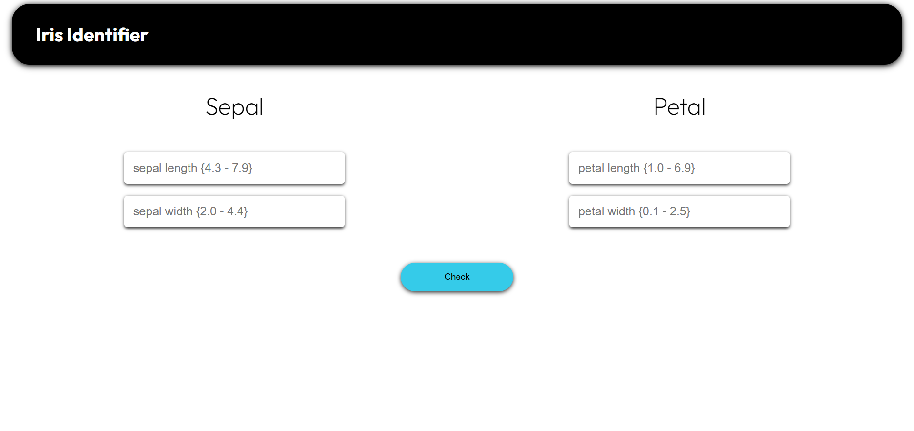
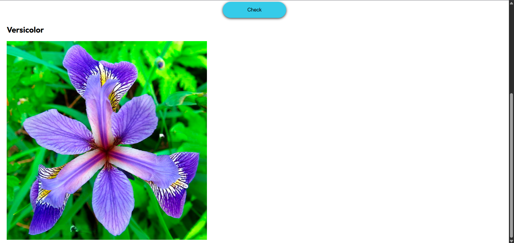

# 🌸 Iris Identifier

A simple web application that predicts the species of an Iris flower (Setosa, Versicolor, or Virginica) based on its sepal and petal dimensions using a machine learning model trained on the famous Iris dataset.

## 🚀 Features

- Input sepal & petal measurements via web interface
- Predicts the Iris species using a trained ML model
- Clean and responsive UI built with HTML/CSS (optionally Bootstrap)
- Flask backend for request handling & model inference
- Trained with scikit-learn

## 📊 Demo

 <!-- Replace with your screenshot path -->
 <!-- Replace with your screenshot path -->

## 🧠 Model

The model is trained on the Iris dataset available on `UCI Machine Learning Repository`. It uses 4 features:

- Sepal Length
- Sepal Width
- Petal Length
- Petal Width

Common algorithms you can try:
- Logistic Regression
- Decision Tree
- KNN
- SVM

## 🛠️ Tech Stack

- **Frontend**: HTML, CSS
- **Backend**: Python, Flask
- **ML**: scikit-learn
- **Deployment**: Localhost
